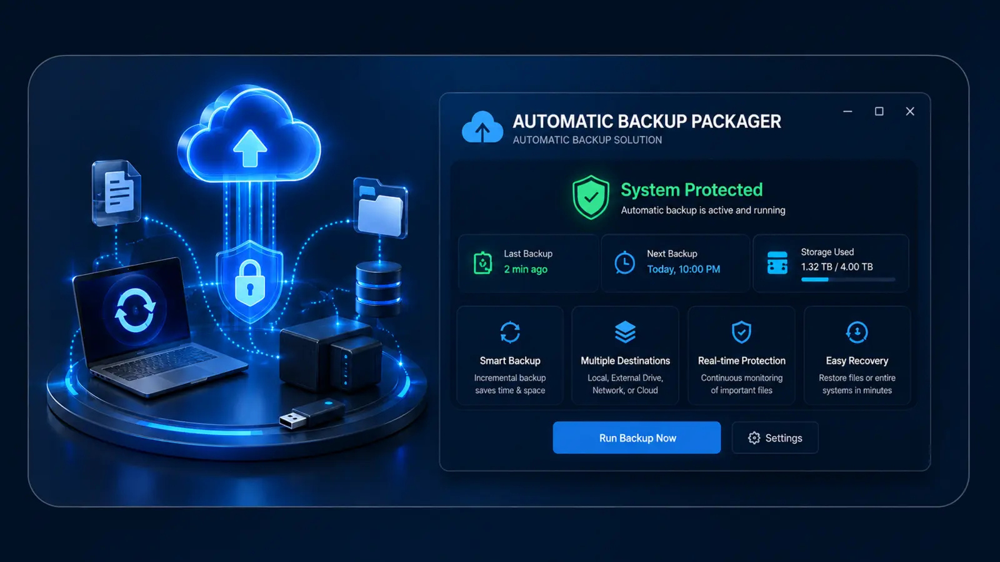
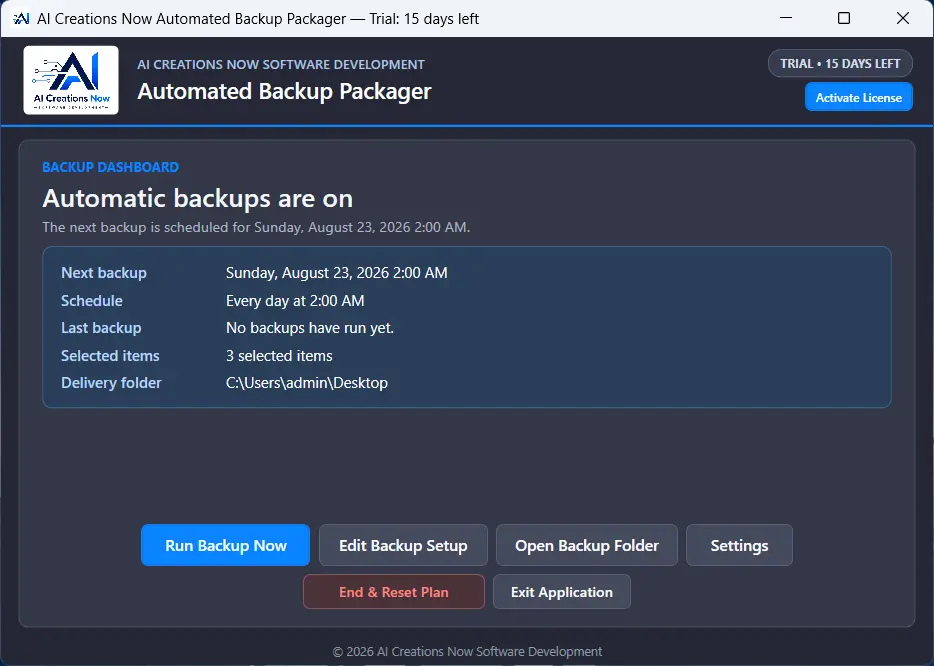

  

<h1 align="center">Automated Backup Packager</h1>

Simple scheduled ZIP backups for Windows from **AI Creations Now Software Development**. Select the files and folders you want to protect, choose a schedule and destination, and create standard ZIP archives that Windows can open.

  <a href="https://aicreatenow.com/backupsoftware.html">Official product page</a> · <a href="https://download.aicreatenow.com/software/AI_Creations_Now_Backup_Packager_v1.0_64Bit_SetupSigned.exe">Download the 15-day trial</a> · <a href="https://aicreatenow.com/backupsoftware.html">Buy a lifetime license — $3.99 USD</a>

  

## Features

- Build one editable backup plan from selected folders and individual files.
- Schedule backups daily, every three days, every five days, weekly, every two weeks, or monthly, at your chosen time.
- Start an immediate backup with **Run Backup Now**.
- Preserve original drive and folder paths inside a normal ZIP archive.
- Identify backup archives by computer name, date, and time.
- Save to a local folder, an external drive, or a folder managed by a desktop cloud-sync application.
- Review activity logs with the result, file count, bytes read, output location, and unreadable files.
- Manage the plan from a dashboard with controls to run, edit, open the destination, or reset the plan.

  

[Watch the product walkthrough](https://download.aicreatenow.com/media/aicreatenow/backupsoftwarepromo4k.mp4).

## Requirements

- 64-bit Windows 11 or a supported Windows Server installation with Desktop Experience.
- Administrator approval for installation and scheduled-task setup.
- Read access to the selected files and folders.
- Enough free space at the backup destination, with that destination available when the backup runs.
- Internet access for trial and license activation.

The application uses Windows Task Scheduler. Version **1.0** supports one active automatic backup plan.

## Download and setup

1. Download the [signed Windows installer](https://download.aicreatenow.com/software/AI_Creations_Now_Backup_Packager_v1.0_64Bit_SetupSigned.exe).
2. Run Setup, review the installer privacy policy, and choose an installation folder.
3. Choose a schedule, select source folders and files, and select the ZIP destination.
4. Review the plan and run your first backup.
5. Open the finished ZIP and use the dashboard and log to review the result.

## Trial, price, and activation

The **15-day trial includes every feature** and requires no credit card. A **$3.99 USD one-time payment** buys a lifetime license for **one Windows computer**, with lifetime upgrades and customer support. There is no subscription.

[Purchase through the official product page](https://aicreatenow.com/backupsoftware.html). A **10-digit activation key is sent within one hour after purchase**. Enter a valid key to continue after the trial.

Existing ZIP archives are not deleted when the trial expires or the plan is reset. You can reuse the activation code after reinstalling on the same computer. Contact support for a major hardware change or a requested license transfer.

## Backup behavior

Source files are copied into the archive; the program does not move or delete them. ZIP archives are **not password-encrypted**. An open or locked file can be copied only when Windows allows it to be read.

For OneDrive or Google Drive, select a folder managed by the provider's separate Windows sync application. Backup Packager creates the ZIP locally; the sync application handles any cloud upload according to your account settings.

## Support

Email [info@aicreatenow.com](mailto:info@aicreatenow.com) or call **1-866-315-4750**. Include the product name and a description of the issue when requesting help.

[Product details](https://aicreatenow.com/backupsoftware.html) · [Privacy policy](https://aicreatenow.com/privacy.html) · [Software refund policy](https://aicreatenow.com/cancellation.html#software-refunds)

See [support information](SUPPORT.md) for what to include when requesting help.

## Practical guide and release notes

[Getting started and common questions](GETTING-STARTED.md) · [GitHub release notes](https://github.com/aicreatenowdom/automated-backup-packager/releases) · [Support](SUPPORT.md)

GitHub's **Code → Download ZIP** contains this repository's documentation and artwork. Get the Windows application through the [official product page](https://aicreatenow.com/backupsoftware.html).

## Source and licensing

This repository contains documentation for proprietary software. Application source code is not included. Obtain the application and its applicable terms through the official product page.

---

Developed by [AI Creations Now Software Development](https://github.com/aicreatenowdom) · [Official software catalog](https://aicreatenow.com/software.html)
